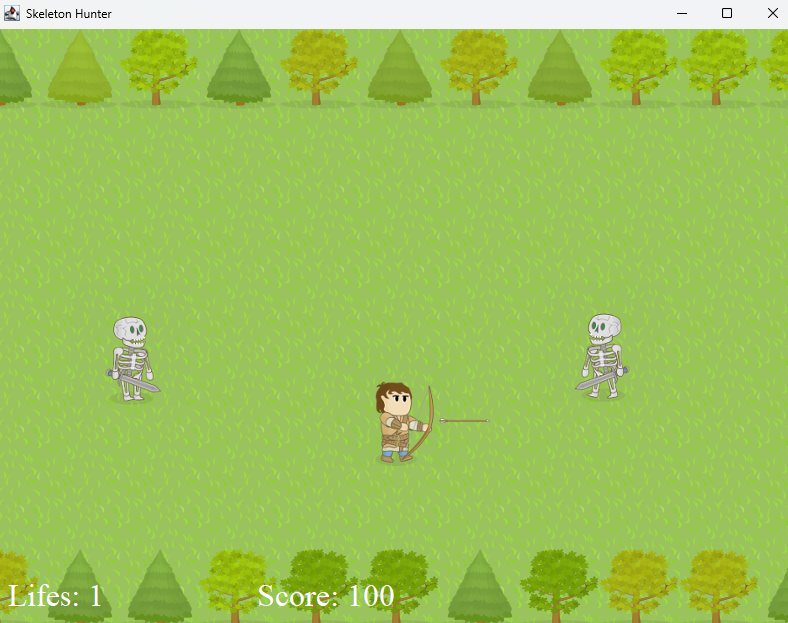
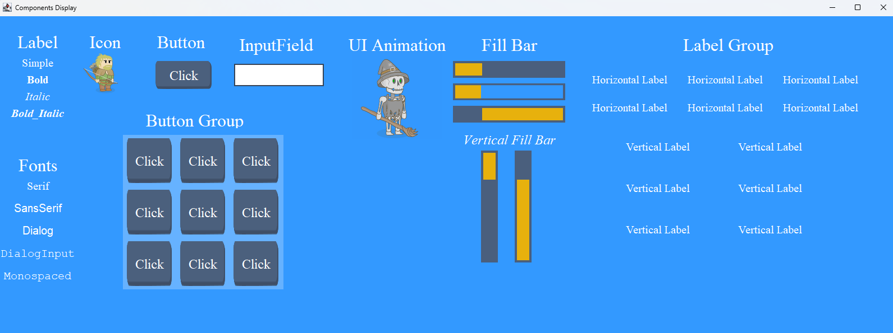

# Crow Framework

> Java based framework and game engine for 2D game development.
- **Simple Engine** for fast 2D game development
- Complete **Framework API** available for complex projects
- **Java based** 2D game development

## Getting Started

Crow Framework is both a **framework** and **game engine** with lots of features to easy the development of 2D games in
Java. The framework by itself has features for game-play development, video, audio and input handling.

The **Crow Engine** was created based on the framework to hide some complexity from the framework and accelerate the
development of simple games and provides 'managers' for handling each one of the framework capabilities.

The framework has a strong Unity influence. It is very much based on the composition of game objects and its
components. That is to say, most of your game logic will be handled inside the 'update()' method from your components
and from the interaction between the components.

# Installation

To use Crow Framework you first have to include its dependency in your project.

## Gradle

Add the framework dependency to your `build.gradle`:
```groovy
implementation 'com.vrozsa:crow-framework:1.0.0'
```

## Maven

Add the framework dependency to your `pom.xml`:
```xml
<dependency>
    <groupId>com.vrozsa</groupId>
    <artifactId>crow-framework</artifactId>
    <version>1.0.0</version>
</dependency>

```

# Framework

The framework can be used directly by consuming its modules and features, or it can be used through the engine created
to abstract the handling and interaction between these modules.

If you are new to game development or want to focus on 'making a game' more than 'creating a game engine', you should try
the **Crow Engine** first.

> If you are planning to create your own engine over the framework modules, take a look at the Engine code, so you can
> have an example approach on how to do it.

## Modules

The framework is composed of six modules:

- **screen** - handles the rendering of game objects and UI elements
- **input** - handles player input from mouse and keyboard
- **audio** - handles playing sound effects and game music
- **game** - handles game play logic and the game-loop
- **shared** - contains resources shared between all modules as well as shared utilities for logging, time and image
  handling, and reusable patterns
- **engine** - contains a default way of creating games using the Crow Framework modules as well some facilities that
  may be useful when developing over the framework directly

## Sample Project

As I have spent most of the time improving the framework code along the years, I spent little time creating
functional documentation or unit tests. The doom of hobby projects is having time to carry on quality related
tasks =''D).

In any case, I've provided lots of sample code in the `sample` module demonstrating how to use the framework features.

I've also provided a sample game called `Skeleton Hunter Game` in which is demonstrated how to use most of
the framework features through the game engine to create a game.

The entry point for the Skeleton Hunter Game is `games.skeletonhunter.SkeletonHunterGame.main`.



And some code:

```java
public class SkeletonHunterGame {

    public static void main(String[] args) {
        var game = new SkeletonHunterGame();
        game.start();
    }

    public void start() {
        var config = CrowEngineConfig.builder()
                .color(BG_SCREEN_COLOR)
                .title("Skeleton Hunter")
                .assetsPath("/assets/skeletonhunter")
                .showGizmos(false)
                .windowResizable(true)
                .build();

        var crowEngine = CrowEngine.create(config);
        crowEngine.getAudioManager().addAudioClipMetadata(getAudioData());

        var factory = new GameObjectFactory(crowEngine);

        var gameBoard = factory.createGameBoard();
        crowEngine.addGameObject(gameBoard);

        var heroGO = factory.createHero(HERO_STARTING_OFFSET);
        crowEngine.addGameObject(heroGO);

        var enemySpawner = factory.createEnemySpawner(heroGO.getPosition());
        crowEngine.addGameObject(enemySpawner);
    }
}
```

Another interesting sample is the UI components testing code available at
`com.vrozsa.crowframework.sample.screen.templates.ComponentsDisplay`.

You will see that if we want, it is possible to provide a screen solely based on a configuration file.




> The config from this screen is available in the sample project at
> `src/main/resources/assets/templates/components_display.json`.

## Development

### Build the lib

```shell
gradlew :engine:fatJar
```

### Publish
```shell
# Set Nexus username
$env:NEXUS_USER="username"
# Print username
$env:NEXUS_USER
# Set Nexus password
$env:NEXUS_PASSWORD="password"
# Print password
$env:NEXUS_PASSWORD

# Publish
gradlew :engine:publish
```

## Enable assertions while developing

Add this VM flag: `-ea`

## TODO

- Add a sample for loading a whole view from a template.
- Add a method to return the game object builder with the engine injected on it, this way allowing the builder to inject
the crow components dependencies automatically.
- Make screen components do not inherit from java.awt components.
- Allows to pre-load image resources (similar to addAudioClipMetadata from audio)
- Use Identifiable in UI components (instead of the 'tag' attribute).
- Add background (looping) music to Skeleton Hunter game.

## Nice To Have

### A GO component that allows to listen to input over the game object

This can be handled two ways:

#1 - The component itself is a ClickHandler that when a click is detected over the owner game object, has its callback
invoked to perform an action.

#2 - We have a ClickableComponent that when is clicked, the PointerInput generate events forwarding the object in which
the click was detected. This could be extended to provide events as: mouse in, mouse out, pointer press, release and
click.

Both ways will need a special implementation to observe pointer events and to check if the pointer event was over any
valid game object (the components which have the handler or are clickable).


### Allow to setup triggers in animation events

This way, we have flexibility to trigger an event (like enabling a collider) in sync with an animation. For instance,
if we trigger a sword attack collider before or after the swing of a sword, the de-sync will be perceptible by the
player. It will try to dodge what he is seeing and will fail, generating frustration.

### Merge Tracking and Buffered input handler

.. so we won't have an inputHandler API that works half on some implementation and the other half in another
implementation. 


### Add resize capability to window

Allows to resize the game-window inside the game. This way we can have a menu with available/valid resolutions the
player can select.

### Add scale to UIAnimation

Check if worth the trouble.